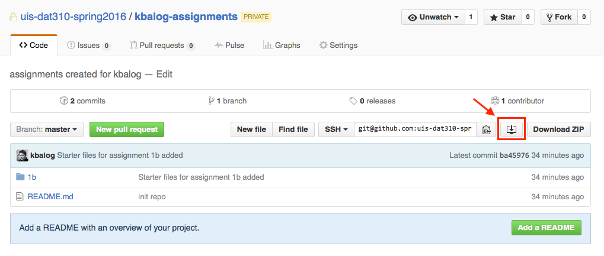
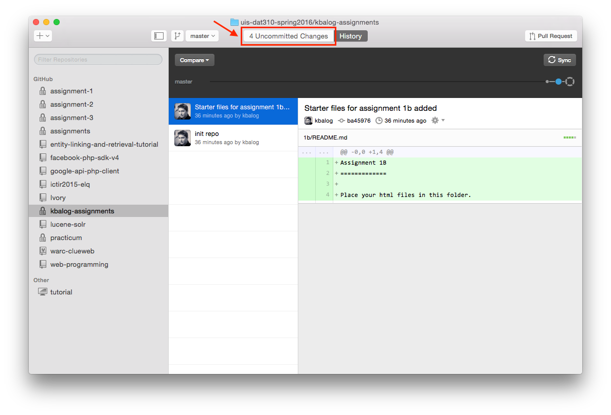

# Using GitHub for DAT310

  * [Repositories](#repositories)
  * [How to use GitHub?](#how-to-use-github)
  * [Step-by-Step How-To](#step-by-step-how-to)

## Repositories

There are three GitHub repositories:

  * [kbalog/web-programming](https://github.com/kbalog/web-programming/): (i.e., this repository) examples and exercises used during the lectures (public)
  * [uis-dat310-spring2017/{yourname}-assignments](https://github.com/uis-dat310-spring2017/): your submissions for the assignments ({yourname} is to be substituted with the username you registered on GitHub) (private)
  * [uis-dat310-spring2017/assignments-2017](https://github.com/uis-dat310-spring2017/assignments-2017): contains the reference solutions to the assignments (posted after the deadline has passed) (private)

Private means that you need to sign up on the [Online Course Admin](http://bit.ly/uis-dat310) to get access to these repositories. (Note that the private repositories will be available only after 17/01!)

### Examples and exercises (web-programming)

You can clone this repository if you want a local copy of the examples and exercises used during the lectures. It is advised that you treat this local copy read-only, that is, you can add new files, but you should not edit any of the existing files to avoid conflicting changes.

Alternatively, you can always just open the exercise files on GitHub and copy-paste their contents into new files on your local computer.

### Your assignments ({username}-assignments)

This is your private repository; no one will (or can) make changes here but you. Clone this repository on your computer, add/edit the files in the folder corresponding to the given assignment, then commit (and push/sync) the changes. You can make sure that your changes have been submitted by checking the contents on the web interface:
https://github.com/uis-dat310/{username}-assignments

### Assignments (assignments)

You will only need this repository when you want to study the reference solutions once they are published. You can clone the repository to have a local copy. You don't have permissions to make changes.

## How to use GitHub?

You can use a graphical client. I recommend the official GitHub client (GitHub Desktop), which is available for both Windows and Mac: https://desktop.github.com/.

You can also work from the command line (for geeks). Here is a crash course: http://try.github.io.

## Step-by-Step How-To

(Illustrated using GitHub Desktop.)

The first two steps are to be done only once.

### 1. Install GitHub Desktop

Download it from: https://desktop.github.com/

### 2. Clone your assignments repository

  * Go to your private repository: https://github.com/uis-dat310/{yourname}-assignments
  * Click the *clone in Desktop* button.

  * Specify the target folder, then you’ll see something like this:

### 3. For each assignment

  * Click the Sync button to receive the starter files (if you cloned the repository for the first time, then you won't see anything new).
  * Complete the assignment — add/edit files in the given assignment folder (e.g., 1b).
  * When you're done, you should see a number of uncommitted changes.
  * Click the button *X Uncommitted Changes* to switch to the list of changes.

  * Make sure all your changes are selected.
  * (A) Fill in the *Summary* (doesn't matter what you put there); the *Description* can be left empty.
  * (B) Click *Commit to master*.
  * (C) Press *Sync*.

That's it. You can double check on the web interface if your changes have been synchronized.

Note that you can submit any number of times; feel free to use this repository as your back-up. Your submission will be evaluated (i.e., looked at) only after the submission deadline.  
