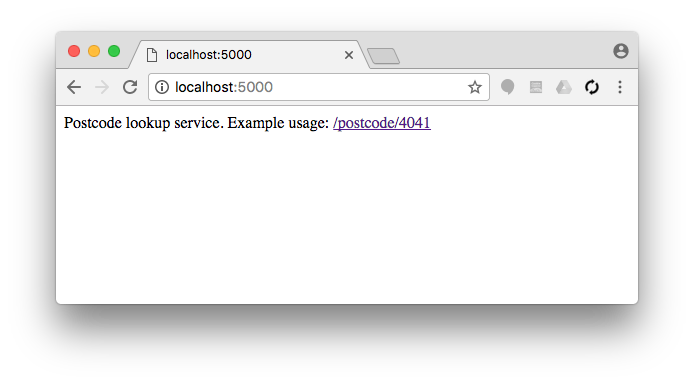
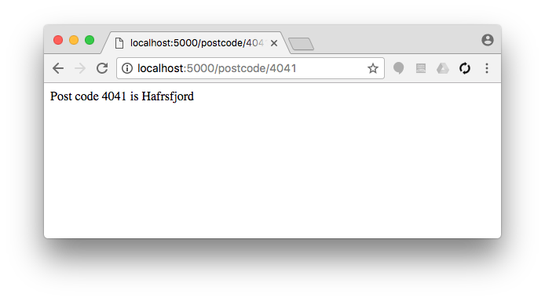
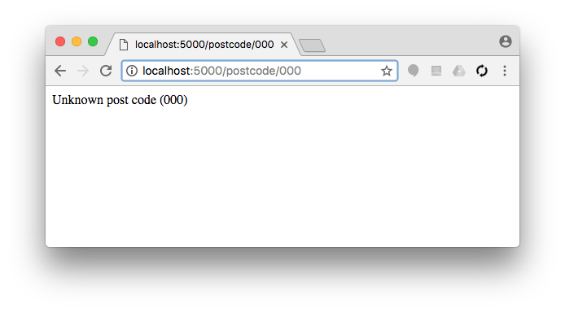

# Python Flask exercises

Documentation: [Flask quickstart](http://flask.pocoo.org/docs/0.12/quickstart/#quickstart)

## Exercise #0: Test Flask Application

Launch the [minimalistic Flask application](../../examples/python/flask_1) and test it by making a request to it both from a browser (http://localhost:5000).


## Exercise #1: Post code lookup service

Create a flask application that can look up location names based on the post code.  Store the locations in a dictionary, e.g.,
```
postcodes = {
    "0001": "Oslo",
    "4036": "Stavanger",
    "4041": "Hafrsfjord",
    "7491": "Trondheim",
    "9019": "Tromsø"
}
```

If the user goes to the index page, return the text "Postcode lookup service. Example usage: /postcode/4041", where the example link should be generated automatically (using `url_for()`) and should be a link (`<a href>...</a>`)


If the post code exists, return the text "Post code {postcode} is {city}"


Otherwise return "Unknown post code ({postcode})"



## Exercise #2: Form handling

Make a HTML form with some input fields and set its action such that it is submitted to your Flask application (using POST). Your application should output a table with the information that was submitted.
