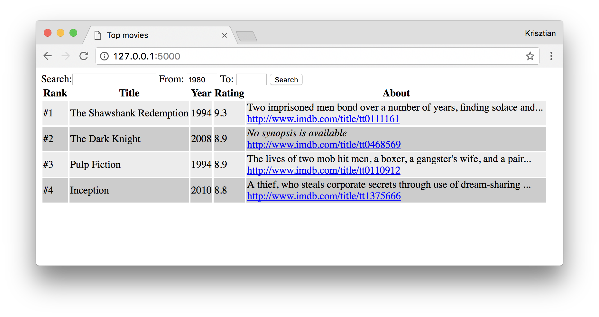

# Server Side Programming exercises (Python, Flask), Part II.

  * [Jinja documentation](http://jinja.pocoo.org/docs/2.9/templates/)

## Exercise #1: Top movies

Complete the `ex_1/templates/movies.html` template file such that information about movies is displayed in a table as seen below.  

Specifically:

  * Sort movies by rating.
  * Show the rank in the first column.
  * The synopsis should be limited to 80 characters. If no synopsis is available display the text "No synopsis is available" in italics.
  * Make the URLs clickable links. The link should open in a new window.
  * Alternate between background colors `#ECECEC` and `#CCCCCC` for even and odd rows.

You need to run the `ex_1/app.py` python file and see the output on [http://localhost:5000/](http://localhost:5000/). Note that you will need to re-start the app each time you make changes to the template file.

**You need to complete this exercise without making any changes to the `app.py` file!**

## Exercise #2: Movie search

Extend the previous exercise with search capability.  The input form has already been added to the [starting files](ex_2/).

  * Return only movies that contain the keywords (given in the search input field) in their title or synopsis. If there are multiple keywords, return only those movies that contain all keywords (check matches case-insensitively).
  * If *From* or *To* are provided, return only movies within the specified time period.
  * When displaying the results, the page should also "remember" the form values that were filled in by the user.
  * If no filters are provided, return all movies.

