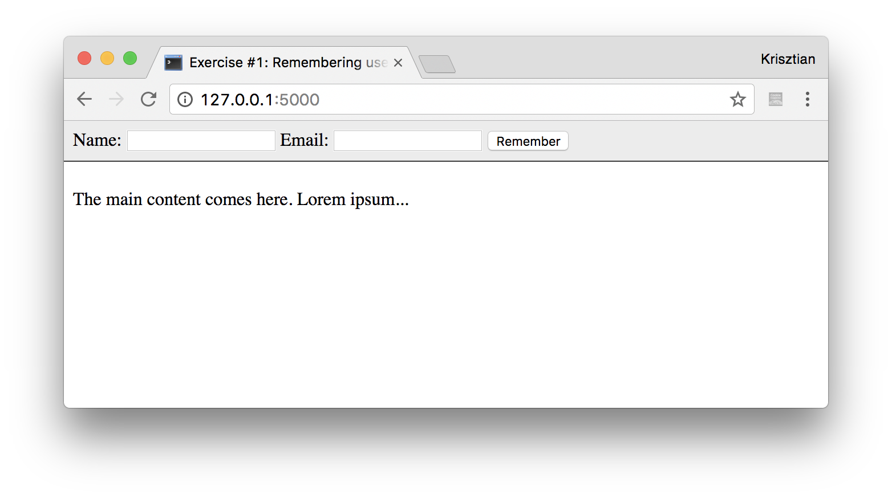
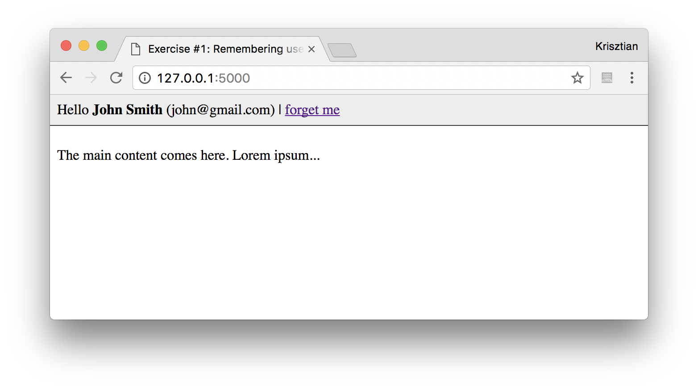

# Server Side Programming exercises (Python, Flask), Part IV.

  * [Flask QuickStart](http://flask.pocoo.org/docs/0.12/quickstart/)
  * [Jinja Templates](http://jinja.pocoo.org/docs/2.9/templates/)

## Exercise #1: Remembering user details

Make a form that asks for the user's name and email address, and then remembers the values using cookies.

  * Check (in the python code) if both name and email are provided. If not, display an error message.  
  * Remember the user's details for 60 days.
  * The user should also be able to "be forgotten" by clicking on a link.
  * Upon successful operations (remembering or forgetting), show a success message.
  * Use [message flashing](http://flask.pocoo.org/docs/0.12/patterns/flashing/#message-flashing-pattern) with `success` and `error` categories for displaying these messages.  The messages should be displayed inside the `<main>` element, above the content part. The style definitions are already created for the `success` and `error` classes.

The [skeleton of the app](ex_1/) is provided, which already includes the form that asks for the name and email and methods for the requests (to be completed).

Visiting http://127.0.0.1:5000/ **before** the user's details are remembered:

Visiting http://127.0.0.1:5000/ **after** the user's details are remembered:

